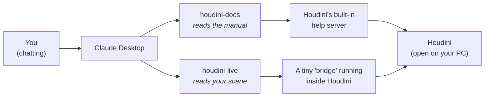
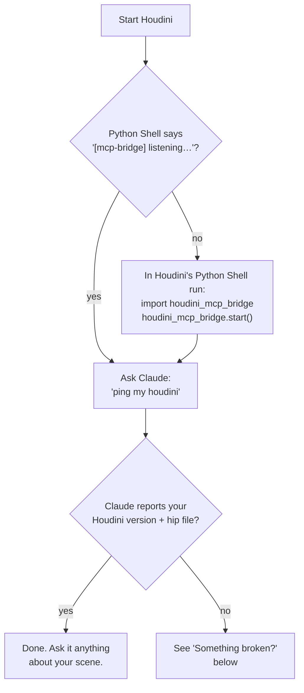

# houdini-live-mcp

**Let Claude see inside your Houdini.**

Normally, when you ask Claude about your Houdini scene, you have to copy-paste code and describe everything yourself. This project removes that step. Claude can look at your scene, read your VEX, check your sim, and even take a screenshot of your viewport, all by itself.

---

## What you get

Two connections ("MCP servers") between the Claude Desktop app and Houdini:

| Connection | What Claude can do with it |
|---|---|
| **houdini-docs** | Read the Houdini manual that's already on your computer: the exact docs for *your* Houdini version, no internet needed |
| **houdini-live** | Look inside your **open** Houdini session: nodes, wrangle code, geometry, attributes, sim state, the viewport itself |

So a conversation can go like this:

> **You:** "Why is my wrangle red?"
>
> **Claude:** *reads the node, reads your VEX, reads the error, checks the docs*, then answers: "Your `pcfind` call returns an array but you assigned it to a float. Here's the fix."

No copy-pasting. Claude checked for itself.

## How it works



Plain version: Claude Desktop starts the two small programs in the `server/` folder. One talks to Houdini's built-in manual. The other talks to a small "bridge" that runs inside Houdini and answers questions about your scene. Everything stays on your computer. Nothing goes online.

## What's in this folder

```
houdini-live-mcp/
│
├── setup.ps1        ← the installer: run this once (Windows)
│
├── server/          ← the two programs Claude Desktop runs
│                      (leave them here, wherever you cloned this)
│
├── houdini/         ← two small files that go into Houdini's settings folder
│   ├── scripts/python/houdini_mcp_bridge.py   (the bridge)
│   └── python3.11libs/uiready.py              (auto-starts the bridge)
│
└── docs/DEVELOPMENT.md   ← technical deep-dive (only if you're curious)
```

---

## Setup

Three steps. About 5 minutes.

### Step 1: What you need first

- **Houdini** (built on 21.0; other recent versions likely work)
- **Claude Desktop**: [claude.ai/download](https://claude.ai/download)
- **uv**: a small tool that runs the servers. Install: [docs.astral.sh/uv](https://docs.astral.sh/uv/getting-started/installation/)

Then download this project:

```
git clone https://github.com/mizarzulfa/houdini-live-mcp.git
```

(or click **Code → Download ZIP** on GitHub and unzip it somewhere you'll keep it)

### Step 2: Run the installer

In the project folder, right-click **setup.ps1** and choose **Run with PowerShell**.

It does all the fiddly parts for you:

- prepares the two server programs
- copies the two Houdini files into your Houdini settings folder
- finds Claude Desktop's config file (its location is different on every machine) and registers both servers, backing up your old config first

When it says **Setup complete**, you're done here. It's safe to run again any time.

> Window flashes open and closes, or Windows complains about scripts? Open PowerShell in the folder and run:
> `powershell -ExecutionPolicy Bypass -File .\setup.ps1`
>
> On Mac or Linux? There's no script yet; follow the short manual steps in [docs/DEVELOPMENT.md](docs/DEVELOPMENT.md).

### Step 3: Restart and switch them on

1. Restart **both** apps: Claude Desktop first, then Houdini.
2. In Claude Desktop, open a chat and click the **+** (plus) button, then **Connectors**.
3. You should now see **houdini-docs** and **houdini-live** in the list. Turn both toggles **on**.

That's it. They stay on for future chats.

> Not in the list at all? Run setup.ps1 again and read its output, then restart Claude Desktop again.

---

## Did it work?



## Something broken?

| Problem | Fix |
|---|---|
| Claude says it can't reach Houdini | Is Houdini actually open? Restart it and look for the `[mcp-bridge] listening` line in the Python Shell |
| No `[mcp-bridge]` line at startup | Run setup.ps1 again; it re-copies the Houdini files and tells you where they went |
| Claude ignores Houdini questions | The toggles from Step 3 are off. **+** (plus) button → Connectors → turn both on |
| houdini-docs / houdini-live missing from the Connectors list | Run setup.ps1 again (it rewrites the config), then restart Claude Desktop. Manual details: [docs/DEVELOPMENT.md](docs/DEVELOPMENT.md) |
| "bad token" error | Delete the hidden file `.houdini_mcp_token` in your user folder (e.g. `C:\Users\you`), then restart Houdini and Claude Desktop. It regenerates itself |
| Docs search says "no doc server reachable" | Just open Houdini. Its manual server starts with the app |

## Good to know

- **Everything is local.** The bridge only accepts connections from your own computer (`127.0.0.1`), guarded by a password the two sides generate and share automatically (a hidden file called `.houdini_mcp_token` in your user folder). Nothing is exposed to the internet, and you never have to set anything up.
- **Claude can also *change* your scene** (that's the `run_python` tool). It's powerful (that's the point), but treat it like giving a colleague the keyboard: save your work.
- Curious how it actually works, or want to add your own tools? → [docs/DEVELOPMENT.md](docs/DEVELOPMENT.md)

## License

[MIT](LICENSE), free to use, copy, and modify.
