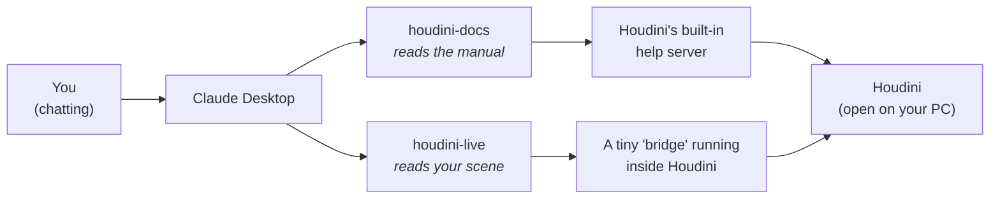
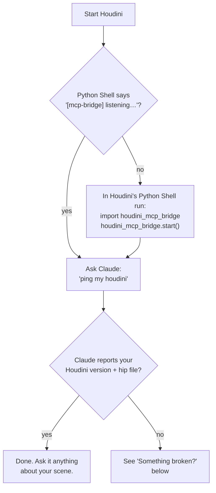

# houdini-live-mcp

**Let Claude see inside your Houdini.**

Normally, when you ask Claude about your Houdini scene, you have to copy-paste code and describe everything yourself. This project removes that step. Claude can look at your scene, read your VEX, check your sim, and even take a screenshot of your viewport — by itself.

---

## What you get

Two connections ("MCP servers") between the Claude Desktop app and Houdini:

| Connection | What Claude can do with it |
|---|---|
| **houdini-docs** | Read the Houdini manual that's already on your computer — the exact docs for *your* Houdini version, no internet needed |
| **houdini-live** | Look inside your **open** Houdini session: nodes, wrangle code, geometry, attributes, sim state, the viewport itself |

So a conversation can go like this:

> **You:** "Why is my wrangle red?"
>
> **Claude:** *reads the node, reads your VEX, reads the error, checks the docs* — "Your `pcfind` call returns an array but you assigned it to a float. Here's the fix."

No copy-pasting. Claude checked for itself.

## How it works



Plain version: Claude Desktop starts the two small programs in the `server/` folder. One talks to Houdini's built-in manual. The other talks to a small "bridge" that runs inside Houdini and answers questions about your scene. Everything stays on your computer — nothing goes online.

## What's in this folder

```
houdini-live-mcp/
│
├── server/          ← the two programs Claude Desktop runs
│                      (leave them here, wherever you cloned this)
│
├── houdini/         ← two small files YOU copy into Houdini's settings folder
│   ├── scripts/python/houdini_mcp_bridge.py   (the bridge)
│   └── python3.11libs/uiready.py              (auto-starts the bridge)
│
└── docs/DEVELOPMENT.md   ← technical deep-dive (only if you're curious)
```

---

## Setup

Four steps. About 10 minutes.

### Step 1 — What you need first

- **Houdini** (built on 21.0; other recent versions likely work)
- **Claude Desktop** — [claude.ai/download](https://claude.ai/download)
- **uv** — a small tool that runs the servers. Install: [docs.astral.sh/uv](https://docs.astral.sh/uv/getting-started/installation/)

Then download this project:

```
git clone https://github.com/mizarzulfa/houdini-live-mcp.git
```

(or click **Code → Download ZIP** on GitHub and unzip it somewhere you'll keep it)

### Step 2 — Copy two files into Houdini's settings folder

Houdini keeps your personal settings in a folder like this (match the number to your version):

- **Windows:** `Documents\houdini21.0`
- **Mac:** `~/Library/Preferences/houdini/21.0`
- **Linux:** `~/houdini21.0`

Copy the two files from this project's `houdini/` folder into it, keeping the same sub-folders:

| Copy this file | Into this place |
|---|---|
| `houdini/scripts/python/houdini_mcp_bridge.py` | `Documents\houdini21.0\scripts\python\` |
| `houdini/python3.11libs/uiready.py` | `Documents\houdini21.0\python3.11libs\` |

If a folder doesn't exist yet, just create it. (Already have a `uiready.py`? See the note in the file — merge, don't overwrite.)

### Step 3 — Set the password

The bridge only listens to programs that know a shared password. Out of the box it's a placeholder — change it to anything random, **the same in both files**:

| File | Line to change |
|---|---|
| `Documents\houdini21.0\scripts\python\houdini_mcp_bridge.py` | `AUTH_TOKEN = "change-me-to-a-random-secret"` |
| `server\houdini_live_mcp.py` (in this project) | `AUTH_TOKEN = "change-me-to-a-random-secret"` |

### Step 4 — Tell Claude Desktop about the servers

Open Claude Desktop → **Settings → Developer → Edit Config**. Add this, fixing the two kinds of paths for your machine:

```json
{
  "mcpServers": {
    "houdini-docs": {
      "command": "C:\\Users\\YOU\\.local\\bin\\uv.exe",
      "args": ["--directory", "C:\\path\\to\\houdini-live-mcp\\server", "run", "houdini_docs_mcp.py"]
    },
    "houdini-live": {
      "command": "C:\\Users\\YOU\\.local\\bin\\uv.exe",
      "args": ["--directory", "C:\\path\\to\\houdini-live-mcp\\server", "run", "houdini_live_mcp.py"]
    }
  }
}
```

- `command` = the full path to `uv` on your computer
- `--directory` = the full path to this project's `server` folder

Now restart **both** apps: Claude Desktop first, then Houdini.

---

## Did it work?



## Something broken?

| Problem | Fix |
|---|---|
| Claude says it can't reach Houdini | Is Houdini actually open? Restart it and look for the `[mcp-bridge] listening` line in the Python Shell |
| No `[mcp-bridge]` line at startup | The two files from Step 2 aren't in the right folders — re-check the table |
| Claude Desktop doesn't show the tools at all | The config from Step 4 has a wrong path. Both paths must be full absolute paths |
| "bad token" error | The password in the two files doesn't match (Step 3) |
| Docs search says "no doc server reachable" | Just open Houdini — its manual server starts with the app |

## Good to know

- **Everything is local.** The bridge only accepts connections from your own computer (`127.0.0.1`), guarded by your password. Nothing is exposed to the internet.
- **Claude can also *change* your scene** (that's the `run_python` tool). It's powerful — that's the point — but treat it like giving a colleague the keyboard: save your work.
- Curious how it actually works, or want to add your own tools? → [docs/DEVELOPMENT.md](docs/DEVELOPMENT.md)

## License

[MIT](LICENSE) — free to use, copy, and modify.
