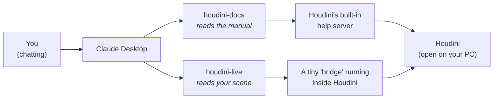
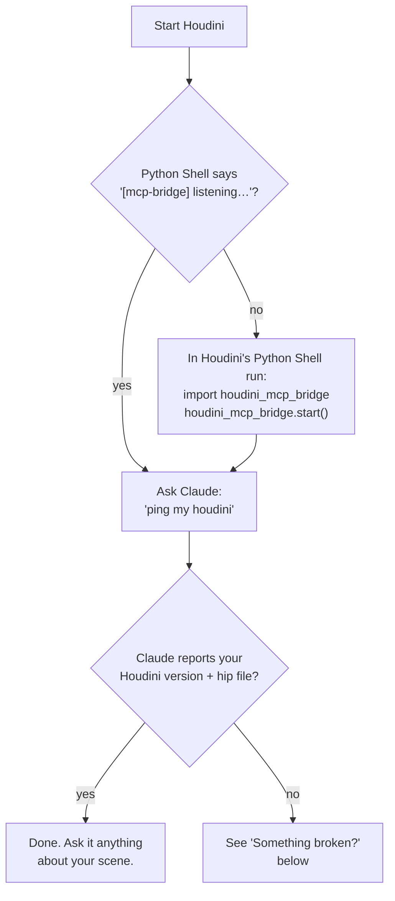

# houdini-live-mcp

**Let Claude see inside your Houdini.**

Normally, when you ask Claude about your Houdini scene, you have to copy-paste code and describe everything yourself. This project removes that step. Claude can look at your scene, read your VEX, check your sim, and even take a screenshot of your viewport, all by itself.

---

## What you get

Two connections ("MCP servers") between the Claude Desktop app and Houdini:

| Connection | What Claude can do with it |
|---|---|
| **houdini-docs** | Read the Houdini manual that's already on your computer: the exact docs for *your* Houdini version, no internet needed |
| **houdini-live** | Look inside your **open** Houdini session: nodes, wrangle code, geometry, attributes, sim state, the viewport itself |

So a conversation can go like this:

> **You:** "Why is my wrangle red?"
>
> **Claude:** *reads the node, reads your VEX, reads the error, checks the docs*, then answers: "Your `pcfind` call returns an array but you assigned it to a float. Here's the fix."

No copy-pasting. Claude checked for itself.

## How it works



Plain version: Claude Desktop starts the two small programs in the `server/` folder. One talks to Houdini's built-in manual. The other talks to a small "bridge" that runs inside Houdini and answers questions about your scene. Everything stays on your computer. Nothing goes online.

## What's in this folder

```
houdini-live-mcp/
│
├── server/          ← the two programs Claude Desktop runs
│                      (leave them here, wherever you cloned this)
│
├── houdini/         ← two small files YOU copy into Houdini's settings folder
│   ├── scripts/python/houdini_mcp_bridge.py   (the bridge)
│   └── python3.11libs/uiready.py              (auto-starts the bridge)
│
└── docs/DEVELOPMENT.md   ← technical deep-dive (only if you're curious)
```

---

## Setup

Four steps. About 10 minutes.

### Step 1: What you need first

- **Houdini** (built on 21.0; other recent versions likely work)
- **Claude Desktop**: [claude.ai/download](https://claude.ai/download)
- **uv**: a small tool that runs the servers. Install: [docs.astral.sh/uv](https://docs.astral.sh/uv/getting-started/installation/)

Then download this project:

```
git clone https://github.com/mizarzulfa/houdini-live-mcp.git
```

(or click **Code → Download ZIP** on GitHub and unzip it somewhere you'll keep it)

### Step 2: Copy two files into Houdini's settings folder

Houdini keeps your personal settings in a folder like this (match the number to your version):

- **Windows:** `Documents\houdini21.0`
- **Mac:** `~/Library/Preferences/houdini/21.0`
- **Linux:** `~/houdini21.0`

Copy the two files from this project's `houdini/` folder into it, keeping the same sub-folders:

| Copy this file | Into this place |
|---|---|
| `houdini/scripts/python/houdini_mcp_bridge.py` | `Documents\houdini21.0\scripts\python\` |
| `houdini/python3.11libs/uiready.py` | `Documents\houdini21.0\python3.11libs\` |

If a folder doesn't exist yet, just create it.

> Rare case: if that last folder already contains a file named `uiready.py`, don't replace it (something else on your machine uses it too). [docs/DEVELOPMENT.md](docs/DEVELOPMENT.md) explains how to combine them. Most people will never hit this.

### Step 3: Tell Claude Desktop about the servers

Open Claude Desktop → **Settings → Developer → Edit Config**. This opens a file called `claude_desktop_config.json`.

> **Always use that Settings button to find the file.** Its real location is different on every machine, so don't copy a path from a tutorial:
>
> | Your setup | Where the file usually is |
> |---|---|
> | Windows (normal install) | `%APPDATA%\Claude\claude_desktop_config.json` |
> | Windows (Microsoft Store install) | `C:\Users\<you>\AppData\Local\Packages\Claude_<random-id>\LocalCache\Roaming\Claude\claude_desktop_config.json` |
> | Mac | `~/Library/Application Support/Claude/claude_desktop_config.json` |
>
> The `<random-id>` part is unique per machine. The Settings button always lands in the right place, whatever your install type.

Add this to the file, replacing the two kinds of paths with the real ones on **your** machine:

```json
{
  "mcpServers": {
    "houdini-docs": {
      "command": "C:\\Users\\YOU\\.local\\bin\\uv.exe",
      "args": ["--directory", "C:\\path\\to\\houdini-live-mcp\\server", "run", "houdini_docs_mcp.py"]
    },
    "houdini-live": {
      "command": "C:\\Users\\YOU\\.local\\bin\\uv.exe",
      "args": ["--directory", "C:\\path\\to\\houdini-live-mcp\\server", "run", "houdini_live_mcp.py"]
    }
  }
}
```

- `command` = the full path to `uv` on your computer. Don't know it? Run `where uv` in a terminal (Mac/Linux: `which uv`)
- `--directory` = the full path to this project's `server` folder, wherever you put it in Step 1

Nothing else in this project is machine-specific: these two paths in the config are the only things you personalize.

### Step 4: Restart and switch them on

1. Restart **both** apps: Claude Desktop first, then Houdini.
2. In Claude Desktop, open a chat and click the **paperclip** button (where you attach files), then **Connectors**.
3. You should now see **houdini-docs** and **houdini-live** in the list. Turn both toggles **on**.

That's it. They stay on for future chats.

> Not in the list at all? The config from Step 3 didn't load: re-check both paths and restart Claude Desktop again.

---

## Did it work?



## Something broken?

| Problem | Fix |
|---|---|
| Claude says it can't reach Houdini | Is Houdini actually open? Restart it and look for the `[mcp-bridge] listening` line in the Python Shell |
| No `[mcp-bridge]` line at startup | The two files from Step 2 aren't in the right folders. Re-check the table |
| Claude ignores Houdini questions | The toggles from Step 4 are off. Paperclip button → Connectors → turn both on |
| houdini-docs / houdini-live missing from the Connectors list | The config from Step 3 has a wrong path. Both paths must be full absolute paths |
| "bad token" error | Delete the hidden file `.houdini_mcp_token` in your user folder (e.g. `C:\Users\you`), then restart Houdini and Claude Desktop. It regenerates itself |
| Docs search says "no doc server reachable" | Just open Houdini. Its manual server starts with the app |

## Good to know

- **Everything is local.** The bridge only accepts connections from your own computer (`127.0.0.1`), guarded by a password the two sides generate and share automatically (a hidden file called `.houdini_mcp_token` in your user folder). Nothing is exposed to the internet, and you never have to set anything up.
- **Claude can also *change* your scene** (that's the `run_python` tool). It's powerful (that's the point), but treat it like giving a colleague the keyboard: save your work.
- Curious how it actually works, or want to add your own tools? → [docs/DEVELOPMENT.md](docs/DEVELOPMENT.md)

## License

[MIT](LICENSE), free to use, copy, and modify.
